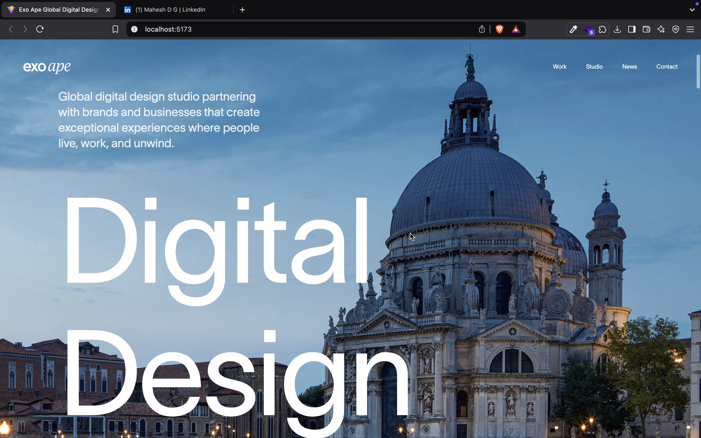

# Exoape Website Clone 🎨✨

A stunning recreation of the **exoape.com** website using **React, GSAP, Locomotive Scroll, and Framer Motion** to achieve smooth scrolling, immersive animations, and dynamic interactions.

## 📸 Preview




## 🚀 Live Demo
🔗 [Live Project]( https://exo-ape-seven.vercel.app/ )

## 📂 Project Overview
This project replicates the beautiful and interactive design of Exoape's website, focusing on:
- **Smooth scrolling** with Locomotive.js
- **Advanced animations** using GSAP & Framer Motion
- **Responsive UI** for a seamless experience across devices
- **High-performance rendering** for smooth transitions

## 🛠️ Tech Stack
- **React.js** – Component-based UI development
- **GSAP** – High-performance animations
- **Framer Motion** – Smooth UI interactions
- **Locomotive Scroll** – Enhanced scrolling experience
- **SCSS/CSS Modules** – Clean and maintainable styles

## 📸 Preview
_(Add screenshots or GIFs showcasing animations and smooth scrolling)_

## 🔧 Installation & Setup
1. **Clone the repo:**
   ```bash
   git clone https://github.com/your-username/exoape-clone.git
   cd exoape-clone
